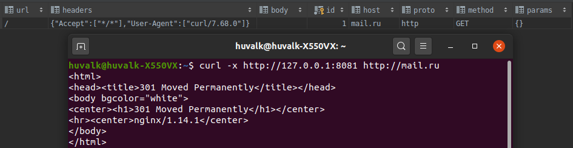
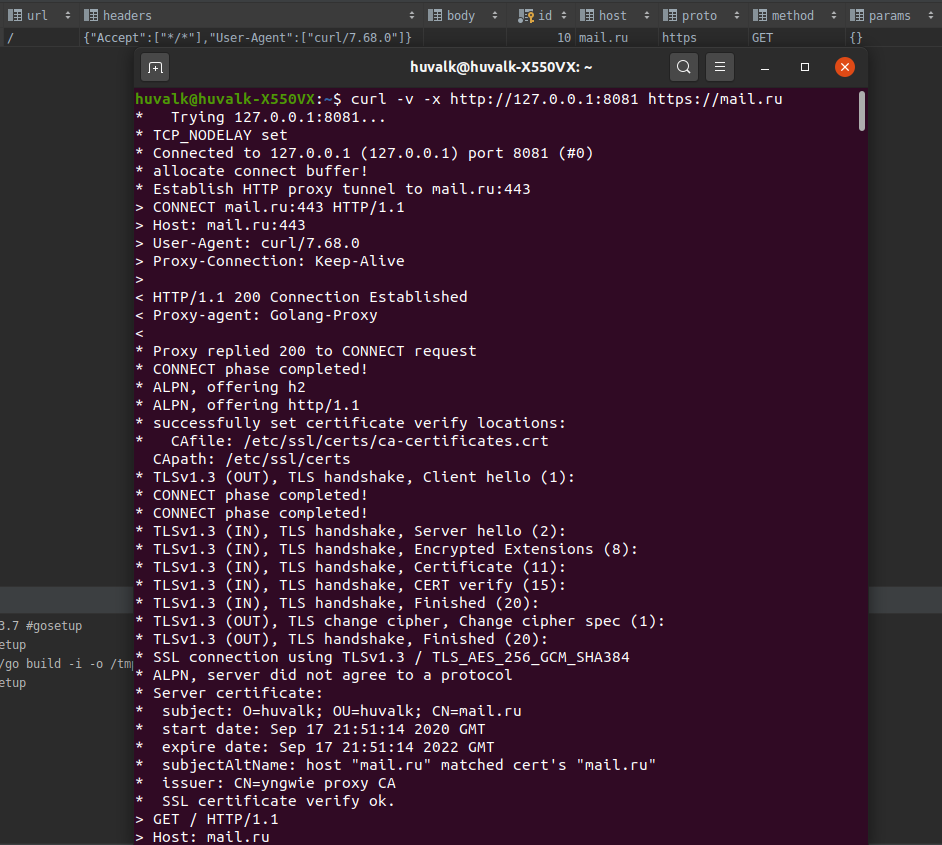
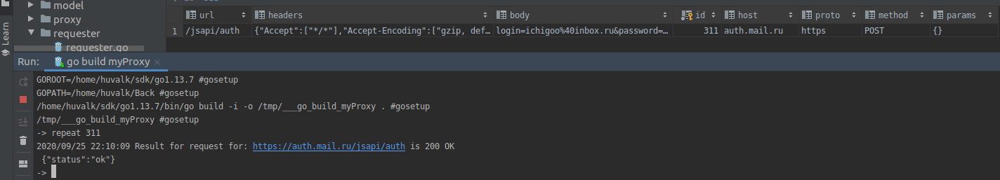
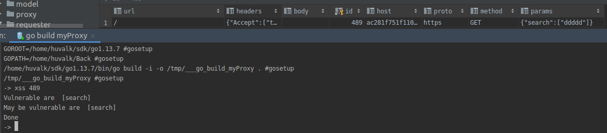
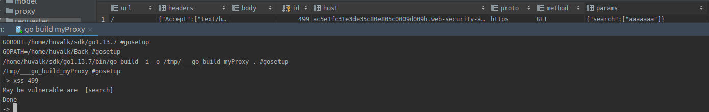
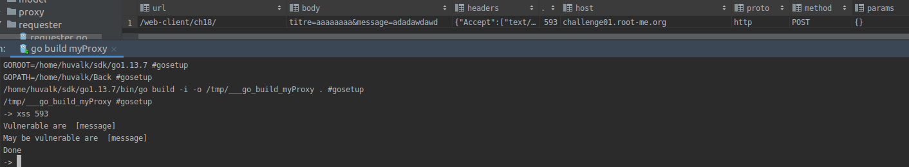

# Перед запуском setup.sh
### Проксирование HTTP запросов

### Проксирование HTTPS запросов

### Повторная отправка проксированных запросов

### Сканер уязвимости XSS
Задача https://portswigger.net/web-security/cross-site-scripting/reflected/lab-html-context-nothing-encoded

Задача https://portswigger.net/web-security/cross-site-scripting/contexts/lab-javascript-string-single-quote-backslash-escaped

Задача https://www.root-me.org/en/Challenges/Web-Client/XSS-Stored-1?lang=en
